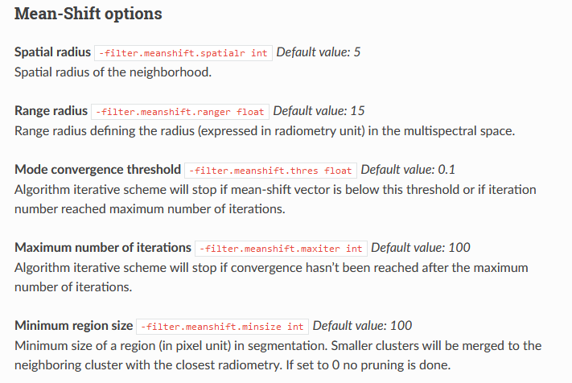
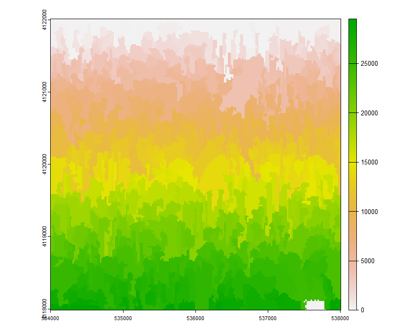
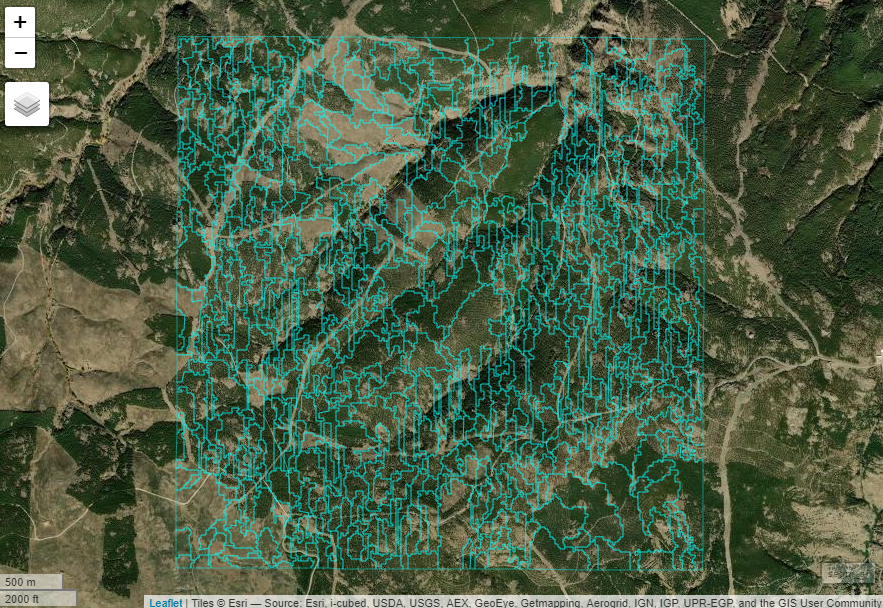
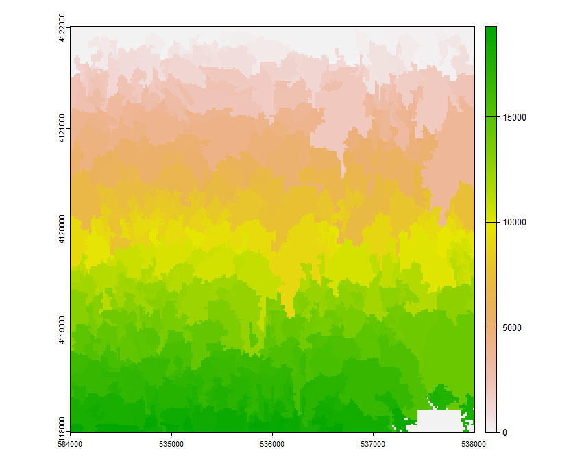
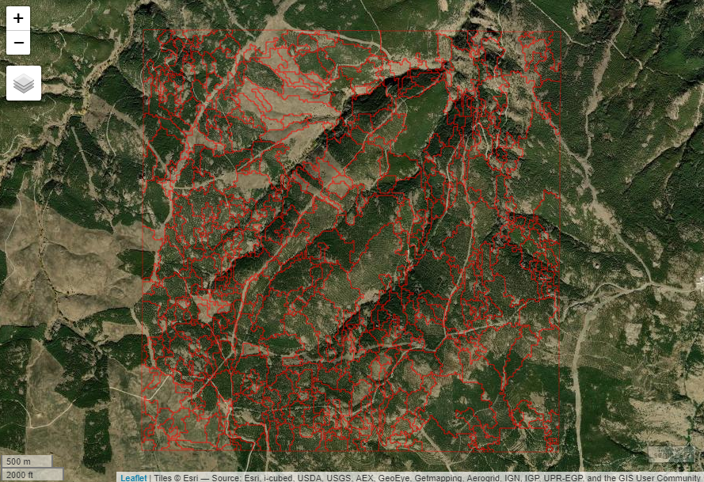

# Capitulo14_Rodalizacion

La segmentación como medio para obtener una rodalización dasocrática uniforme de la estructura forestal es una técnica especialmente interesante cuando se combinan datos dasocráticos obtenidos a partir de la modelización LiDAR que se vio en el capítulo 13 del presente libro, junto con información espectral (por ejemplo, un índice NDVI de una imagen Landsat podría aportar información del estado fisiológico del arbolado) o mapas de orientaciones para que los rodales resultantes sigan las reglas de la rodalización tradicional basada en líneas permanentes del terreno.

# 1. Creación de la imagen a segmentar
En el presente ejemplo se va a partir de la modelización del área basimétrica realizada en el capítulo anterior. El usuario puede realizar si lo desea la modelización de otros datos dasocráticos. En la carpeta Capas_base se facilitan la densidad (N) en pies/ha y la altura dominante (H) en metros, así como el mapa de orientaciones reclasificado del 1 al 4 según el pixel pertenezca a Norte-Este-Sur-Oeste.

```r
#Cargar la librería con la que se van a trabajar los datos raster
library(terra)
N<-rast("G:/Descarga/N.tif") #Adaptar a la ruta en la que se haya hecho la descarga
G<-rast("G:/Descarga/G.tif") #Adaptar a la ruta en la que se haya hecho la descarga
H<-rast("G:/Descarga/H.tif") #Adaptar a la ruta en la que se haya hecho la descarga
ori<-rast("G:/Descarga/orientaciones.tif") #Adaptar a la ruta en la que se haya hecho la descarga

#Visualizar las capas raster
plot(N)
plot(G)
plot(H)
plot(ori)

#Rango de valores de cada raster sin tener en cuenta los valores nulos (na.rm=TRUE)
range(values(N),na.rm=TRUE)
range(values(G),na.rm=TRUE)
range(values(H),na.rm=TRUE)
range(values(ori),na.rm=TRUE)
```

Cuando se realiza un proceso de segmentación, se debe tener en cuenta que los algoritmos utilizarán los niveles digitales de los que están compuestos los píxeles de cada una de las capas raster. Ésto significa que tendrá mucho más peso la capa cuyo rango de valores sea mayor, en este caso la densidad, descrita en número de pies por hectárea y casi no quedará reflejada en la segmentación las orientaciones, puesto que sólo toma valores entre 1 y 4.

```r
#Función de reescalado
reescalado = function(r){
  # obtener los valores máximos mínimos de la capa
  minmax_r = range(values(r), na.rm=TRUE) 
  # rescalar 
  return( (r-minmax_r[1]) / (diff(minmax_r)))
}

#Aplicación de la función de reescalado
N_r<-reescalado(N)
G_r<-reescalado(G)
H_r<-reescalado(H)
ori_r<-reescalado(ori)
```

Una vez reescalados, se unen en un mismo raster con tantas bandas como capas utilizadas y se guarda para su utilización durante el proceso de segmentación.
```r
#Crear raster multibanda
s <- stack(N_r, G_r, H_r,ori_r)

#Guardar raster
writeRaster(s,"G:/Descarga/s.tif") #Adaptar a la ruta que se desee emplear
```

# 2. Configuración de la herramienta para segmentar
Ahora para la realización de la segmentación en sí se va a utilizar Orfeo ToolBox (OTB), que consiste en una herramienta de código abierto para sensores remotos de última generación. Construido con la ayuda de la comunidad geoespacial de código abierto, puede procesar imágenes ópticas, multiespectrales y de radar de alta resolución a escala de terabytes para diversas utilidades que van desde ortorrectificación o pan-sharpening, hasta clasificación, procesamiento SAR y mucho más. 


Es posible emplearlo desde QGIS, sin embargo, en el presente ejercicio se va a configurar para manejarlo desde R a través de la librería SegOptim y así aprovechar la potencia estadística de este último. Para ello, se van a seguir los pasos descritos en [esta página](https://segoptim.bitbucket.io/docs/installation.html) y que se van a detallar aquí.

Primero será necesario descargar e instalar el paquete binario de OTB más reciente desde la página web y seleccionando su sistema operativo.


[https://www.orfeo-toolbox.org/download/](https://www.orfeo-toolbox.org/download/)

Después de instalarlo localiza la carpeta *bin* del programa (por ejemplo, C:/OTB/bin en windows). Será uno de los parámetros que se utilicen en la segmentación más abajo.

A continuación, se descarga la librería SegOptim que va a servir de enlace entre R y OTB. Se trata de un paquete que no está en el CRAN de R, por lo que es necesario compilarlo e instalarlo desde la fuente en GitHub

```r
#Comprobación de si está instalado el paquete necesario para la descarga desde GitHub
if(!requireNamespace("remotes")){
  install.packages("remotes")
}

# Instalación del paquete unbalanced necesario en algunos algoritmos de clasificación
remotes::install_github("dalpozz/unbalanced")

# Instalación de SegOptim con las últimas actualizaciones
remotes::install_github("joaofgoncalves/SegOptim")
```

Seguidamente se configuran las entradas al algoritmo de segmentación para que algunas de las entradas de la función *segmentation_OTB_LSMS()* que se utilizará sean automáticas. Se emplearán como variables la carpeta bin del programa mencionada anteriormente, el directorio en el que se guardarán las salidas y la imagen raster que se utilizará para segmentar. 

```r
#Directorio de la carpeta bin del programa
otb_path <- "C:/OTB-8.0.1-Win64/bin" #Adaptar a la ruta en la que se haya instalad OTB

#Directorio de trabajo
setwd("G:/Descarga/")  #Adaptar a la ruta en la que se vayan a configurar las salidas de la segmentación

#Ruta de la imagen a segmentar
imagen.path <- "G:/Descarga/s.tif" #Adaptar a la ruta en la que se haya guardado la imagen generada en el paso 1
```

# 3. Segmentación Mean-Shift

Antes de realizar la segmentación en sí, es conveniente comprender los parámetros que utiliza y cómo afectan al resultado para así decidir qué valores asignarles en cada situación. En el [*CookBook*](https://www.orfeo-toolbox.org/CookBook/Applications/app_Segmentation.html) del OTB se describen su significado.



Para comprender mejor la segmentación Mean-Shift dentro del ámbito forestal es recomendable leer el artículo [Forest Stand Delineation Using a Hybrid Segmentation Approach Based on Airborne Laser Scanning Data ](https://link.springer.com/chapter/10.1007/978-3-642-38886-6_10) que Zhengzhe Wu y sus colaboradores publicaron en la 18 conferencia escandinava sobre análisis de imágenes en 2013.

En la aplicación de la función de segmentación, existen cuatro parámetros principales: tres para el algoritmo de Mean-Shift (rango espectral, rango espacial y tamaño mínimo de la región) y uno para el control de la expansión de características (número máximo de iteraciones. Lo habitual es establecer unos valores lógicos para los primeros teniendo en cuenta que se tratan de masas forestales con unas características concretas y estudiando los histogramas de las imágenes empleadas. Luego, basándose en estas conclusiones, se elige un rango de parámetros para generar resultados optimizados y se comparan con los restantes.

```r
#Visualización del histograma de las imágenes reescaladas.
par(mfrow=c(2,2))
hist(s,layer=1,breaks=50)
hist(s,layer=2,breaks=50)
hist(s,layer=3,breaks=50)
hist(s,layer=4,breaks=50)
```


Con estos resultados, se puede pensar que un rango espectral razonable entre 0.01 y 0.05 agruparía los rodales semejantes. Por otro lado, sabiendo que la resolución de la imagen es de píxeles del tamaño de 19 m de lado, un rango espacial de búsqueda de segmentos similares de entre 3 y 6 píxeles contiguos podría dar buenos resultados. 

```r
#Tamaño de pixel de la imagen s
res(s)
```

```r annotate
[1] 19 19
```

Y, finalmente, para conseguir un segmento de una hectárea, serían necesarios unos 30 píxeles.

$$ 10000/(19·19)=27,7 píxeles $$

Se puede hacer una primera prueba para establecer si resultan lógicos los parámetros deducidos para la masa en la que se esté trabajando.

```r
#Activación de la librería SegOptim
library(SegOptim)

#Aplicación de la segmentación Mean-Shift a través de Orfeo
out_segm_obj <- segmentation_OTB_LSMS(
  inputRstPath  = imagen.path,               #Ruta en la que se encuentra la imagen a segmentar
  SpectralRange = 0.05,                      #Rango espectral
  SpatialRange  = 5,                         #Rango espacial
  MinSize       = 30,                        #Tamaño mínimo del segmento
  lsms_maxiter  = 50,                        #Número máximo de iteraciones
  outputSegmRst = "./segmRaster.tif",        #Imagen raster resultante
  verbose       = TRUE,                      #Muestra en pantalla la evolución del algoritmo
  otbBinPath    = otb_path)                  #Ruta en la que se encuentra el programa Orfeo Toolbox
```

Una vez finalizado el proceso será necesario transformar el raster resultante a un shapefile poligonal y valorar 

```r
# Cargar el raster de segmentos y visualizarlo
library(terra)
segm_rst <- rast(out_segm_obj$segm)
plot(segm_rst)
```



Y se procede a convertirlo en shapefile.

```r
#Transformación del raster a shapefile
segm_sf<- as.polygons(segm_rst)

#Visualización del shapefile
library(mapview)
mapview(segm_sf,map.types="Esri.WorldImagery",color = 'cyan',legend =FALSE,
        alpha.regions = 0)
```



Ahora se puede valorar subjetivamente lo adecuada que es la segmentación realizada para rodalizar la zona de estudio.

Otra forma para valorar la segmentación, más objetiva, es a través del análisis de las superficies que ocupan cada una de las partes que lo componen y su variabilidad.

```r
#Cálculo de la superficie de cada segmento
segm_sf$area<-expanse(segm_sf,unit="m")

#Tamaño medio de los segmentos en hectáreas
mean(segm_sf$area)/10000
```

```r annotate
[1] 2.932969
```

```r
#Tamaño máximo de los segmentos en hectáreas
max(segm_sf$area)/10000
```

```r annotate
[1] 27.20416
```

```r
#Tamaño minimo de los segmentos en hectáreas
min(segm_sf$area)/10000
```

```r annotate
[1] 1.08383
```

```r
#Número de segmentos que componen la segmentación
length(segm_sf$area)
```

```r annotate
[1] 551
```

Dados los resultados del tamaño medio de los segmentos y su distribución, quizás se podría pensar en aumentar los rangos espacial y espectral para que los segmentos incrementen su tamaño.

```r
#Aplicación de la segmentación Mean-Shift a través de Orfeo
out_segm_obj <- segmentation_OTB_LSMS(
  inputRstPath  = imagen.path,               #Ruta en la que se encuentra la imagen a segmentar
  SpectralRange = 0.1,                       #Rango espectral
  SpatialRange  = 10,                        #Rango espacial
  MinSize       = 30,                        #Tamaño mínimo del segmento
  lsms_maxiter  = 50,                        #Número máximo de iteraciones
  outputSegmRst = "./segmRaster.tif",        #Imagen raster resultante
  verbose       = TRUE,                      #Muestra en pantalla la evolución del algoritmo
  otbBinPath    = otb_path)                  #Ruta en la que se encuentra el programa Orfeo Toolbox

# Cargar el raster de segmentos y visualizarlo
segm_rst2 <- rast(out_segm_obj$segm)
plot(segm_rst2)
```



Y se repite la operación anterior para transformalo en shapefile

```r
#Transformación del raster a shapefile
segm_sf2<- as.polygons(segm_rst2)

#Visualización del shapefile
mapview(segm_sf2,map.types="Esri.WorldImagery",color = 'red',legend =FALSE,
        alpha.regions = 0)
```



Ahora se puede comparar visualmente con el generado previamente.

Para una comparación analítica de ambas segmentaciones de forma que se pueda extraer una conclusión objetiva sobre cuál es la más adecuada a la masa forestal estudiada, es recomendable valorar la homogeneidad interna y la heterogeneidad externa de la segmentación. Se puede realizar a partir de diversas técnicas. Aquí se emplea la varianza ponderada por la superficie para estimar la bondad de la segmentación intra-segmento.

$$  \omega Var=\frac{\sum_{}^{}  a_{i}* v_{i}}{\sum_{}^{}  a_{i}} $$

Donde $v_{i}$ es la varianza del segmento *i* y  $a_{i}$ la superficie del segmento *i*

Y, por otro lado, el índice de Moran, que mide la autocorrelación espacial de datos con información espacial, se puede utilizar para medir lo diferentes que son los segmentos unos de otros dentro de cada segmentación.

$$ MI=\frac{n\sum_{}^{}w_{ij}·(y_{i}-\overline{y})·(y_{j}-\overline{y})}{\sum(y_{i}-\overline{y})^2(\sum [\sum w_{ji}])} $$

Donde *n* es el numero total de segmentos, $w_{ij}$ es una medida de la proximidad espacial, $y_{i}$ es el valor espectral medio de la región *i*, $\overline{y}$ es el valor espectral medio de la imagen. Cada peso $w_{ij}$ es una medida de la regiones espaciales adyacentes.

Ésto mismo implementado en R, quedaría así:

```r
#Para la primera segmentacion
medias<-zonal(s,segm_rst,fun="mean")      #Calculo de los valores medios en los segmentos para las imágenes de densidad, altura dominante, área basimétrica y orientaciones reescaladas
desviaciones<-zonal(s,segm_rst,fun="sd")  #Calculo de las desviaciones estándar en los segmentos para las imágenes de densidad, altura dominante, área basimétrica y orientaciones reescaladas

#Varianza
varianzas<-(desviaciones^2)
varianzas<-as.data.frame(varianzas)

#Homogeneidad interna
homo.int.N<-sum(segm_sf$area*varianzas$N)/sum(segm_sf$area)
homo.int.G<-sum(segm_sf$area*varianzas$G)/sum(segm_sf$area)
homo.int.H<-sum(segm_sf$area*varianzas$H,na.rm=TRUE)/sum(segm_sf$area)
homo.int.ori<-sum(segm_sf$area*varianzas$orientaciones,na.rm=TRUE)/sum(segm_sf$area)

homo.int.N;homo.int.G;homo.int.H;homo.int.ori
```

```r annotate
[1] 0.03497933
[1] 0.01015894
[1] 0.01426646
[1] 0.0377141
```

```r 
#Heterogeniedad externa
library(spdep)
library(sf)
#Definir los poligonos vecinos
nb <- poly2nb(st_as_sf(segm_sf), queen=TRUE)
nb[1] #Imprimirá en pantalla los polígonos vecinos al primero
```

```r annotate
[[1]]
[1] 468 507
```

```r
#Asignar pesos a los vecinos
lw <- nb2listw(nb, style="W", zero.policy=TRUE)
lw$weights[1] #Imprimirá en pantalla los pesos asignados a cada vecino del primer polígono
```

```r annotate
[[1]]
[1] 0.5 0.5
```

```r
#Cálculo del estadístico del índice de Moran
hete.ext.N<- moran(medias$N, lw, length(nb), Szero(lw),NAOK = TRUE)[1]
hete.ext.G<- moran(medias$G, lw, length(nb), Szero(lw),NAOK = TRUE)[1]
hete.ext.H<- moran(medias$H, lw, length(nb), Szero(lw),NAOK = TRUE)[1]
hete.ext.ori<- moran(medias$orientaciones, lw, length(nb), Szero(lw),NAOK = TRUE)[1]

hete.ext.N;hete.ext.G;hete.ext.H;hete.ext.ori
```

```r annotate
$I
[1] 0.4437964

$I
[1] 0.4921384

$I
[1] 0.6455489

$I
[1] 0.3379061
```

```r 
#Para la segunda segmentacion
#Cálculo de superficies
segm_sf2$area<-expanse(segm_sf2,unit="m")
medias2<-zonal(s,segm_rst2,fun="mean")      #Calculo de los valores medios en los segmentos para las imágenes de densidad, altura dominante, área basimétrica y orientaciones reescaladas
desviaciones2<-zonal(s,segm_rst2,fun="sd")  #Calculo de las desviaciones estándar en los segmentos para las imágenes de densidad, altura dominante, área basimétrica y orientaciones reescaladas

#Varianza
varianzas2<-(desviaciones2^2)
varianzas2<-as.data.frame(varianzas2)

#Homogeneidad interna
homo.int.N2<-sum(segm_sf2$area*varianzas2$N)/sum(segm_sf2$area)
homo.int.G2<-sum(segm_sf2$area*varianzas2$G)/sum(segm_sf2$area)
homo.int.H2<-sum(segm_sf2$area*varianzas2$H,na.rm=TRUE)/sum(segm_sf2$area)
homo.int.ori2<-sum(segm_sf2$area*varianzas2$orientaciones,na.rm=TRUE)/sum(segm_sf2$area)

homo.int.N2;homo.int.G2;homo.int.H2;homo.int.ori2
```

```r annotate
[1] 0.03411438
[1] 0.01010498
[1] 0.01365106
[1] 0.03402862
```

```r 
#Heterogeniedad externa
library(spdep)
library(sf)
#Definir los poligonos vecinos
nb2 <- poly2nb(st_as_sf(segm_sf2), queen=TRUE)
nb2[1]

#Asignar pesos a los vecinos
lw2 <- nb2listw(nb2, style="W", zero.policy=TRUE)
lw2$weights[1]

#Cálculo del estadístico del índice de Moran
hete.ext.N2<- moran(medias2$N, lw2, length(nb2), Szero(lw2),NAOK = TRUE)[1]
hete.ext.G2<- moran(medias2$G, lw2, length(nb2), Szero(lw2),NAOK = TRUE)[1]
hete.ext.H2<- moran(medias2$H, lw2, length(nb2), Szero(lw2),NAOK = TRUE)[1]
hete.ext.ori2<- moran(medias2$orientaciones, lw2, length(nb2), Szero(lw2),NAOK = TRUE)[1]

hete.ext.N2;hete.ext.G2;hete.ext.H2;hete.ext.ori2
```

```r annotate
$I
[1] 0.388659

$I
[1] 0.4509606

$I
[1] 0.5831269

$I
[1] 0.1905525
```
Y ahora se pueden comparar los valores medios de homogeneidad interna y heterogeneidad externa para ambas segmentaciones de forma que se pueda tomar una decisión

```r
#Valor medio de homogeneidad interna de la primera segmentación
mean(homo.int.N[[1]],homo.int.N[[1]],homo.int.N[[1]],homo.int.N[[1]])
```

```r annotate
[1] 0.03497933
```

```r
#Valor medio de homogeneidad interna de la segunda segmentación
mean(homo.int.N2[[1]],homo.int.N2[[1]],homo.int.N2[[1]],homo.int.N2[[1]])
```

```r annotate
[1] 0.03411438
```

```r
#Valor medio de heterogeneidad externa de la primera segmentación
mean(hete.ext.N[[1]],hete.ext.G[[1]],hete.ext.H[[1]],hete.ext.ori[[1]])
```

```r annotate
[1] 0.4437964
```

```r
#Valor medio de heterogeneidad externa de la segunda segmentación
mean(hete.ext.N2[[1]],hete.ext.G2[[1]],hete.ext.H2[[1]],hete.ext.ori2[[1]])
```

```r annotate
[1] 0.388659
```

Se podría concluir que ante unos valores de homogeneidad interna muy parecidos, la primera segmentación presenta una heterogeneidad entre los distintos segmentos que la componen algo mayor, cosa deseable en una rodalización. En ambos casos, la heterogeneidad externa está más marcada por la altura dominante, seguida por el área basimétrica y en menor medida por las orientaciones. En consecuencia, la selección de la mejor segmentación para la delimitación de masas forestales utilizando la metodología OTB no es tan sencilla como se pensaba anteriormente. Dado que el algoritmo Mean Shift ha demostrado ser un método adecuado para la delimitación de masas forestales, la decisión sobre cuál es la mejor segmentación debe provenir de una concordancia entre las mejores varianzas ponderadas y el mejor índice de Moran, añadiendo el número resultante de segmentos a la decisión, dependiendo de los objetivos de gestión forestal. Para la silvicultura de precisión, los silvicultores pueden requerir una delimitación de rodales muy precisa con respecto a la variación intrarregional con un gran número de segmentos, a pesar de la similitud de los segmentos entre sí. Sin embargo, en los pinares mediterráneos, donde la protección y la gestión del agua son los principales objetivos silvícolas, se exigiría una delimitación del rodal menos precisa, incluyendo áreas más grandes de alta heterogeneidad interregional, con, en consecuencia, un bajo número de segmentos.
