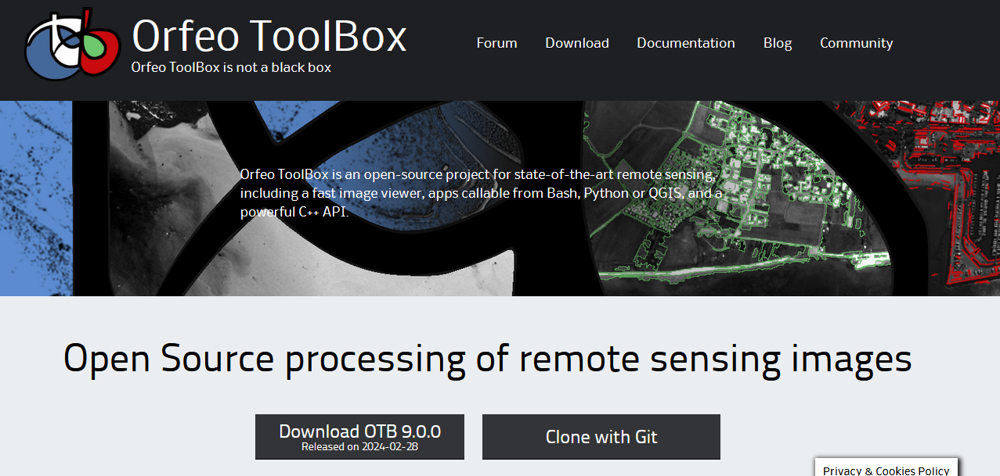

# Capitulo14_Rodalizacion

La segmentación como medio para obtener una rodalización dasocrática uniforme de la estructura forestal es una técnica especialmente interesante cuando se combinan datos dasocráticos obtenidos a partir de la modelización LiDAR que se vio en el capítulo 13 del presente libro, junto con información espectral (por ejemplo, un índice NDVI de una imagen Landsat podría aportar información del estado fisiológico del arbolado) o mapas de orientaciones para que los rodales resultantes sigan las reglas de la rodalización tradicional basada en líneas permanentes del terreno.

# 1. Creación de la imagen a segmentar
En el presente ejemplo se va a partir de la modelización del área basimétrica realizada en el capítulo anterior. El usuario puede realizar si lo desea la modelización de otros datos dasocráticos. En la carpeta Capas_base se facilitan la densidad (N) en pies/ha y la altura dominante (H) en metros, así como el mapa de orientaciones reclasificado del 1 al 4 según el pixel pertenezca a Norte-Este-Sur-Oeste.

```r
#Cargar la librería con la que se van a trabajar los datos raster
library(terra)
N<-rast("G:/Descarga/N.tif") #Adaptar a la ruta en la que se haya hecho la descarga
G<-rast("G:/Descarga/G.tif") #Adaptar a la ruta en la que se haya hecho la descarga
H<-rast("G:/Descarga/H.tif") #Adaptar a la ruta en la que se haya hecho la descarga
ori<-rast("G:/Descarga/orientaciones.tif") #Adaptar a la ruta en la que se haya hecho la descarga

#Visualizar las capas raster
plot(N)
plot(G)
plot(H)
plot(ori)

#Rango de valores de cada raster sin tener en cuenta los valores nulos (na.rm=TRUE)
range(values(N),na.rm=TRUE)
range(values(G),na.rm=TRUE)
range(values(H),na.rm=TRUE)
range(values(ori),na.rm=TRUE)
```

Cuando se realiza un proceso de segmentación, se debe tener en cuenta que los algoritmos utilizarán los niveles digitales de los que están compuestos los píxeles de cada una de las capas raster. Ésto significa que tendrá mucho más peso la capa cuyo rango de valores sea mayor, en este caso la densidad, descrita en número de pies por hectárea y casi no quedará reflejada en la segmentación las orientaciones, puesto que sólo toma valores entre 1 y 4.

```r
#Función de reescalado
reescalado = function(r){
  # obtener los valores máximos mínimos de la capa
  minmax_r = range(values(r), na.rm=TRUE) 
  # rescalar 
  return( (r-minmax_r[1]) / (diff(minmax_r)))
}

#Aplicación de la función de reescalado
N_r<-reescalado(N)
G_r<-reescalado(G)
H_r<-reescalado(H)
ori_r<-reescalado(ori)
```

Una vez reescalados, se unen en un mismo raster con tantas bandas como capas utilizadas y se guarda para su utilización durante el proceso de segmentación.
```r
#Función de reescalado
s <- stack(N_r, G_r, H_r,ori_r)

#Guardar raster
writeRaster(s,"G:/Descarga/s.tif") #Adaptar a la ruta que se desee emplear
```

# 2. Configuración de la herramienta para segmentar
Ahora para la realización de la segmentación en sí se va a utilizar Orfeo ToolBox (OTB), que consiste en una herramienta de código abierto para sensores remotos de última generación. Construido con la ayuda de la comunidad geoespacial de código abierto, puede procesar imágenes ópticas, multiespectrales y de radar de alta resolución a escala de terabytes para diversas utilidades que van desde ortorrectificación o pan-sharpening, hasta clasificación, procesamiento SAR y mucho más. 


Es posible emplearlo desde QGIS, sin embargo, en el presente ejercicio se va a configurar para manejarlo desde R a través de la librería SegOptim y así aprovechar la potencia estadística de este último. Para ello, se van a seguir los pasos descritos en [esta página](https://segoptim.bitbucket.io/docs/installation.html) y que se van a detallar aquí.

Primero será necesario descargar e instalar el paquete binario de OTB más reciente desde la página web y seleccionando su sistema operativo.



[https://www.orfeo-toolbox.org/download/](https://www.orfeo-toolbox.org/download/)

Después de instalarlo localiza la carpeta *bin* del programa (por ejemplo, C:/OTB/bin en windows). Será uno de los parámetros que se utilicen en la segmentación más abajo.

A continuación, se descarga la librería SegOptim que va a servir de enlace entre R y OTB. Se trata de un paquete que no está en el CRAN de R, por lo que es necesario compilarlo e instalarlo desde la fuente en GitHub

```r
#Comprobación de si está instalado el paquete necesario para la descarga desde GitHub
if(!requireNamespace("remotes")){
  install.packages("remotes")
}

# Instalación del paquete unbalanced necesario en algunos algoritmos de clasificación
remotes::install_github("dalpozz/unbalanced")

# Instalación de SegOptim con las últimas actualizaciones
remotes::install_github("joaofgoncalves/SegOptim")
```

Seguidamente se configuran las entradas al algoritmo de segmentación para que algunas de las entradas de la función *segmentation_OTB_LSMS()* que se utilizará sean automáticas. Se emplearán como variables la carpeta bin del programa mencionada anteriormente, el directorio en el que se guardarán las salidas y la imagen raster que se utilizará para segmentar. 

```r
#Directorio de la carpeta bin del programa
otb_path <- "C:/OTB-8.0.1-Win64/bin" #Adaptar a la ruta en la que se haya instalad OTB

#Directorio de trabajo
setwd("G:/Descarga/")  #Adaptar a la ruta en la que se vayan a configurar las salidas de la segmentación

#Ruta de la imagen a segmentar
imagen.path <- "G:/Descarga/s.tif" #Adaptar a la ruta en la que se haya guardado la imagen generada en el paso 1
```

# 3. Segmentación Mean-Shift

Antes de realizar la segmentación en sí, es conveniente comprender los parámetros que utiliza y cómo afectan al resultado para así decidir qué valores asignarles en cada situación. En el [*CookBook*](https://www.orfeo-toolbox.org/CookBook/Applications/app_Segmentation.html) del OTB se describen su significado.


```r
#https://link.springer.com/chapter/10.1007/978-3-642-38886-6_10

library(SegOptim)
out_segm_obj <- segmentation_OTB_LSMS(
  inputRstPath  = imagen.path, 
  SpectralRange = 0.05, 
  SpatialRange  = 5, 
  MinSize       = 30,
  lsms_maxiter  = 50,
  outputSegmRst = "./segmRaster.tif",
  verbose       = TRUE,
  otbBinPath    = otb_path)

# Load the segmented raster and plot it
library(terra)
segm_rst <- rast(out_segm_obj$segm)
plot(segm_rst)

segm_sf<- as.polygons(segm_rst)
segm_sf<-segm_sf

# library(sf)
# segm_sf<-st_as_sf(segm_sf)
plot(segm_sf)
```
